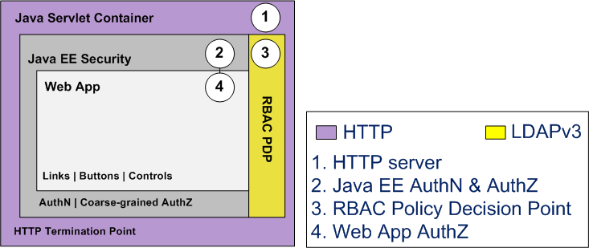

# Overview of the wicket-sample README-ENABLE-FORTRESS README

 * This document demonstrates how to enable java EE and fortress security for the wicket sample app.
 * The intent is to demonstrate how to combine Apache Fortress RBAC into an Apache Wicket web app.
 * The intent is not a how-to guide for fortress security in java web envs.  For that look to [apache-fortress-demo](https://github.com/shawnmckinney/apache-fortress-demo)
 * For more info about the wicket sample: [Link to Wicket Blog](https://iamfortress.net/2015/03/05/the-seven-steps-of-role-engineering/)
 * Wicket Sample System Diagram
 


-------------------------------------------------------------------------------

## Prerequisites
1. Java 8
2. Apache Maven 3++
3. Apache Tomcat 8++
4. Completed section in Apache Fortress Core Quickstart:
    * *SECTION 4. Apache Tomcat Setup* in [README-QUICKSTART-SLAPD.md](https://github.com/apache/directory-fortress-core/blob/master/README-QUICKSTART-SLAPD.md)
    * *SECTION 5. Apache Tomcat Setup* in [README-QUICKSTART-APACHEDS.md](https://github.com/apache/directory-fortress-core/blob/master/README-QUICKSTART-APACHEDS.md)

-------------------------------------------------------------------------------

## How to enable security in this wicket app

1. Completion of [README.md](README.md)

2. Download the fortress realm proxy jar into tomcat/lib folder:

 ```
 wget https://repo.maven.apache.org/maven2/org/apache/directory/fortress/fortress-realm-proxy/2.0.5/fortress-realm-proxy-2.0.5.jar -P $TOMCAT_HOME/lib
 ```

 where *TOMCAT_HOME* matches your target env.

3. Restart tomcat for new settings to take effect.

 Note: The proxy is a shim that uses a [URLClassLoader](http://docs.oracle.com/javase/7/docs/api/java/net/URLClassLoader.html) to reach its implementation libs.  It prevents
 the realm impl libs, pulled in as dependency to web app, from interfering with the container’s system classpath thus providing an error free deployment process free from
 classloader issues.  The proxy offers the flexibility for each web app to determine its own version/type of security realm to use, satisfying a variety of requirements
 related to web hosting and multitenancy.

4.  Add the Java EE security required artifacts

 If you are using the wicket-sample source, this is already done.  It includes wicket components
 [LoginPage.java](src/main/java/org/wicketsample/LoginPage.java), [LogoutPage.java](src/main/java/org/wicketsample/LogoutPage.java)
 (plus associated markup files [LoginPage.html](src/main/resources/org/wicketsample/LoginPage.html), [LogoutPage.html](src/main/resources/org/wicketsample/LogoutPage.html)),
 and the static html files under the src/main/webapp/login folder.  These files control the flow between the container and wicket with java EE security enabled.


 

5. Edit the [pom.xml](pom.xml)

 Prepare maven for fortress.
  * uncomment the fortress web dependency at the top

  ```xml
        ...
        <!-- TODO STEP 3: uncomment for fortress security dependency: -->
        <dependency>
            <groupId>org.apache.directory</groupId>
            <artifactId>fortress-web</artifactId>
            <version>${project.version}</version>
            <classifier>classes</classifier>
        </dependency>
  ```

 At the completion of this step, the necessary binaries will be available to the app and the app’s security policy file will be ready to load.

6. Edit the [web.xml](src/main/webapp/WEB-INF/web.xml)

 Prepare the app for fortress.
  * uncomment the spring settings

 ```xml
  <!-- TODO STEP 4a: uncomment to enable fortress spring bean injection: -->
  <context-param>
      <param-name>contextConfigLocation</param-name>
      <param-value>classpath:applicationContext.xml</param-value>
  </context-param>

  <listener>
      <listener-class>org.springframework.web.context.ContextLoaderListener</listener-class>
  </listener>
 ```

 Notice a reference to spring's context file: [ApplicationContext.xml](src/main/resources/applicationContext.xml).
 It holds the metadata necessary to wire the fortress objects in with their constructors and subsequently get injected into the web app as spring beans.

 ```xml
 <?xml version="1.0" encoding="UTF-8"?>
 <beans xmlns="http://www.springframework.org/schema/beans"
        xmlns:xsi="http://www.w3.org/2001/XMLSchema-instance"
        xsi:schemaLocation="http://www.springframework.org/schema/beans
         http://www.springframework.org/schema/beans/spring-beans.xsd
         http://www.springframework.org/schema/beans
         http://www.springframework.org/schema/beans/spring-beans-3.0.xsd">

     <!-- The Fortress Access Manager bean used for IAM -->
     <bean id="accessMgr" class="org.apache.directory.fortress.core.AccessMgrFactory" scope="prototype"
           factory-method="createInstance">
         <constructor-arg value="HOME"/>
     </bean>
     <!-- The Fortress Realm J2EE Manager bean used for deserializing the principal as returned from tomcat -->
     <bean id="j2eePolicyMgr" class="org.apache.directory.fortress.realm.J2eePolicyMgrFactory" scope="prototype"
           factory-method="createInstance">
     </bean>

 </beans>
 ```

  * uncomment the java ee security constraints

 ```xml
    ...
    <!-- TODO STEP 4b: uncomment to enable Java EE Security -->
    <security-constraint>
        <web-resource-collection>
            <web-resource-name>app</web-resource-name>
            <url-pattern>/wicket/bookmarkable/org.wicketsample.LogoutPage</url-pattern>
        </web-resource-collection>
        <!-- OMIT auth-constraint -->
    </security-constraint>
    <security-constraint>
        <display-name>Wicket Sample Security Constraints</display-name>
        <web-resource-collection>
            <web-resource-name>Protected Area</web-resource-name>
            <url-pattern>/wicket/*</url-pattern>
        </web-resource-collection>
        <auth-constraint>
            <role-name>wsBaseRole</role-name>
        </auth-constraint>
    </security-constraint>
    <login-config>
        <auth-method>FORM</auth-method>
        <realm-name>FortressRealm</realm-name>
        <form-login-config>
            <form-login-page>/login/login.html</form-login-page>
            <form-error-page>/login/error.html</form-error-page>
        </form-login-config>
    </login-config>
    <security-role>
        <role-name>wsBaseRole</role-name>
    </security-role>
    <error-page>
        <error-code>403</error-code>
        <location>/login/unauthorized.html</location>
    </error-page>
    <error-page>
        <error-code>404</error-code>
        <location>/login/pagenotfound.html</location>
    </error-page>
    <error-page>
        <error-code>500</error-code>
        <location>/login/unexpected.html</location>
    </error-page>
    ...
 ```

 Now container security has been enabled for this web app.  It authenticates, checks roles and maintains the session.

7. Rename [context.xml.example](src/main/resources/META-INF/context.xml.example) to context.xml

 Prepare the app for the fortress realm.

 ```xml
 <Context reloadable="true">
   <Realm className="org.apache.directory.fortress.realm.tomcat.Tc7AccessMgrProxy"
          debug="0"
          resourceName="UserDatabase"
          defaultRoles=""
          containerType="TomcatContext"
          realmClasspath=""
   />
 </Context>
 ```

 This file hooks a web app into the tomcat fortress realm which performs declarative (automatic) security functions like authenticate and isUserInRole.

8. Rename [fortress.properties.example](src/main/resources/fortress.properties.example) to fortress.properties.

 Pick One:

 a. Prepare fortress for apacheds usage:

 ```properties
 # This param tells fortress what type of ldap server in use:
 ldap.server.type=apacheds

 # Use value from [Set Hostname Entry]:
 host=localhost

 # ApacheDS defaults to this:
 port=10389

 # These credentials are used for read/write access to all nodes under suffix:
 admin.user=uid=admin,ou=system
 admin.pw=secret

 # This is min/max settings for LDAP administrator pool connections that have read/write access to all nodes under suffix:
 min.admin.conn=1
 max.admin.conn=10

 # This node contains fortress properties stored on behalf of connecting LDAP clients:
 config.realm=DEFAULT
 config.root=ou=Config,dc=example,dc=com

 # Used by application security components:
 perms.cached=true

 # Fortress uses a cache:
 ehcache.config.file=ehcache.xml
 ```

 b. Prepare fortress for openldap usage:

 ```properties
 # This param tells fortress what type of ldap server in use:
 ldap.server.type=openldap

 # Use value from [Set Hostname Entry]:
 host=localhost

 # OpenLDAP defaults to this:
 port=389

 # These credentials are used for read/write access to all nodes under suffix:
 admin.user=cn=Manager,dc=example,dc=com
 admin.pw=secret

 # This is min/max settings for LDAP administrator pool connections that have read/write access to all nodes under suffix:
 min.admin.conn=1
 max.admin.conn=10

 # This node contains fortress properties stored on behalf of connecting LDAP clients:
 config.realm=DEFAULT
 config.root=ou=Config,dc=example,dc=com

 # Used by application security components:
 perms.cached=true

 # Fortress uses a cache:
 ehcache.config.file=ehcache.xml
 ```

9. Edit [WicketApplication.java](src/main/java/org/wicketsample/WicketApplication.java)

 Tell wicket about fortress sessions and objects.
    * uncomment fortress session override

 Here we override app’s wicket session with a new one that can hold onto fortress session and perms:

 ```java
	// TODO STEP 7a: uncomment save fortress session to wicket session:
	@Override
	public Session newSession(Request request, Response response)
	{
		return new WicketSession(request);
	}
 ```

    * uncomment fortress spring bean injector

 Next we tell the app to use spring to inject references to fortress security objects:

 ```java
    // TODO STEP 7b: uncomment to enable injection of fortress spring beans:
    getComponentInstantiationListeners().add(new SpringComponentInjector(this));
 ```

 These steps are necessary to get fortress hooked into the sample app.

10. Edit [WicketSampleBasePage.java](src/main/java/org/wicketsample/WicketSampleBasePage.java)

 Get fortress objects injected to the wicket base page, enable fortress secured page links.
    * uncomment fortress spring bean injection

 ```java
    // TODO STEP 8a: enable spring injection of fortress bean here:
    @SpringBean
    private AccessMgr accessMgr;

    @SpringBean
    private J2eePolicyMgr j2eePolicyMgr;

 ```

 These objects are used by the app to make AccessMgr calls to functions like checkAccess and sessionPermissions.

    * uncomment call to enableFortress

 This performs the boilerplate security functions required by fortress during app session startup:

 ```java
 // TODO STEP 8b: uncomment call to enableFortress:
 try
 {
     SecUtils.enableFortress( this, ( HttpServletRequest ) getRequest().getContainerRequest(), j2eePolicyMgr, accessMgr );
 }
 catch (org.apache.directory.fortress.core.SecurityException se)
 {
     String error = "WicketSampleBasePage caught security exception : " + se;
     LOG.warn( error );
 }
 ```
    * change to FtBookmarkablePageLink

 The advantage here is other than a name change, everything else stays the same, and now the links are secured.

 ```java
 // TODO STEP 8c: change to FtBookmarkablePageLink:
 add( new FtBookmarkablePageLink( "page1.link", Page1.class ) );
 add( new FtBookmarkablePageLink( "page2.link", Page2.class ) );
 add( new FtBookmarkablePageLink( "page3.link", Page3.class ) );
 ```

 This component maps a page link to a fortress permission.  The wicket id passed in, e.g. page1.link, is converted to a fortress permission, objName: page1, opName: link.

11. Edit [Page1.java](src/main/java/org/wicketsample/Page1.java), [Page2.java](src/main/java/org/wicketsample/Page2.java), [Page3.java](src/main/java/org/wicketsample/Page3.java)

 Enable fortress secured buttons.  Each page has three buttons.  Same as before, only the name changes.
    * change to FtIndicatingAjaxButton

 ```java
 // TODO STEP 9a: change to FtIndicatingAjaxButton:
 add( new FtIndicatingAjaxButton( "page1.button1" )
 ```

 This component maps the buttons to fortress permissions.  The wicket id, e.g. page1.button1, is converted to a fortress permission, objName: page1, opName: button1.

12. Build & Deploy (run from the command line):

 Deploy to tomcat server:

 ```maven
 mvn clean tomcat:deploy -Dload.file
 ```

 Or if already deployed:

 ```maven
 mvn clean tomcat:redeploy -Dload.file
 ```

  -Dload.file tells maven to also load the wicket sample security policy into ldap.  Since the load needs to happen just once, you may drop it from future ops:

 ```maven
 mvn tomcat:redeploy
 ```

 Note: If you have problems using the maven auto deploy, copy the *wicket-sample.war* file located under *target* folder to *$TOMCAT_HOME/webapps*

-------------------------------------------------------------------------------

## Understand the security policy using RBAC

To gain full understanding, check out the file used to load it into the LDAP directory: .

App comprised of three pages, each has buttons and links that are guarded by permissions.  The permissions are granted to a particular user via their role assignments.

For this app, user-to-role assignments are:
### User-to-Role Assignment Table

| user          | wsusers1role | wsusers2role | wsusers3role | wssuperrole  |
| ------------- | ------------ | ------------ | ------------ | ------------ |
| wsuser1       | true         | false        | false        | false        |
| wsuser2       | true         | true         | false        | false        |
| wsuser3       | false        | false        | true         | false        |
| wssuperuser   | false        | false        | false        | true         |


The  page roles inherit from a single parent which allow them into the app:

### Role Inheritance Table
| role name     | parent name   |
| ------------- | ------------- |
| wsusers1role  | wsBaseRole    |
| wsusers2role  | wsBaseRole    |
| wsusers3role  | wsBaseRole    |

The superrole inherits from the page roles giving the assignee full access to all pages
and buttons on the app.

### Role Inheritance Table
| role name    | parent name   |
| ------------ | ------------- |
| wssuperrole  | wsusers1role  |
| wssuperrole  | wsusers2role  |
| wssuperrole  | wsusers3role  |

The page links use RBAC perms.

User to Page access is granted as:

### User-to-Page Access Table
| user        | Page1 | Page2 | Page3 |
| ----------- | ----- | ----- | ----- |
| wsuser1     | true  | false | false |
| wsuser2     | false | true  | false |
| wsuser3     | false | false | true  |
| wssuperuser | true  | true  | true  |

The buttons are guarded by rbac permission checks.  The permissions are dependent on which roles are active.

Below is the list of permissions by user.  These list can be returned using [sessionPermissions](https://directory.apache.org/fortress/gen-docs/latest/apidocs/org/apache/directory/fortress/core/AccessMgr.html#sessionPermissions(org.apache.directory.fortress.core.rbac.Session)) API.

### User-to-Permission Access Table

| permission    | wsuser1     | wsuser2     | wsuser3     | wssuperuser |
| ------------- | ----------- | ----------- | ----------- | ----------- |
| Page1.link    | true        | false       | false       | true        |
| Page2.link    | false       | true        | false       | true        |
| Page3.link    | false       | false       | truev       | true        |
| Page1.Button1 | true        | false       | false       | true        |
| Page1.Button2 | true        | false       | false       | true        |
| Page1.Button3 | true        | false       | false       | true        |
| Page2.Button1 | false       | true        | false       | true        |
| Page2.Button2 | false       | true        | false       | true        |
| Page2.Button3 | false       | true        | false       | true        |
| Page3.Button1 | false       | false       | true        | true        |
| Page3.Button2 | false       | false       | true        | true        |
| Page3.Button3 | false       | false       | true        | true        |


## How to test with security enabled

1. Here are the user to role assignments:

 

2. Open link to [http://localhost:8080/wicket-sample](http://localhost:8080/wicket-sample)

3. Use the following creds:

 * wssuperuser/password
   


 * wsuser1/password
   


 * wsuser2/password
   


 * wsuser3/password
   

4. click on the page links

5. click on the buttons

6. Notice that security is now enabled, and how each user has different access rights.


## Enable Java Security Manager (Optional)

1. Add to java policy file:

 ```
 grant codeBase "file:${catalina.home}/webapps/wicket-sample/-" {
    permission java.util.PropertyPermission "org.apache.commons.configuration.filesystem", "read";
    permission java.util.PropertyPermission "org.apache.directory.fortress", "read";
    permission java.util.PropertyPermission "fortress.*", "read";
    permission java.util.PropertyPermission "getenv.*", "read";
    permission java.util.PropertyPermission "net.sf.ehcache.*", "read";
    permission java.util.PropertyPermission "wicket.*", "read";
    permission java.util.PropertyPermission "Wicket_HeaderRenderStrategy", "read";
    permission java.util.PropertyPermission "java.io.tmpdir", "read";
    permission java.util.PropertyPermission "tc.active", "read";
    permission java.util.PropertyPermission "org.springframework.security.core.*", "read";
    permission java.util.PropertyPermission "spring.security.strategy", "read";
    permission java.lang.RuntimePermission "getenv.*", "*";
    permission java.lang.RuntimePermission "accessClassInPackage.org.apache.catalina.util";
    permission java.lang.RuntimePermission "accessDeclaredMembers";
    permission java.lang.RuntimePermission "modifyThread";
    permission java.net.SocketPermission "localhost", "resolve";
    permission java.net.SocketPermission "127.0.0.1:32768", "connect,resolve";
    permission  java.lang.reflect.ReflectPermission "suppressAccessChecks";
    permission java.io.SerializablePermission "enableSubclassImplementation";
 ```

 2. Modify Tomcat server.xml:

  ```
   <Host name="localhost"  appBase="webapps"
    unpackWARs="true" autoDeploy="true"
    deployXML="true">                            <--- Add this declaration
 ```
